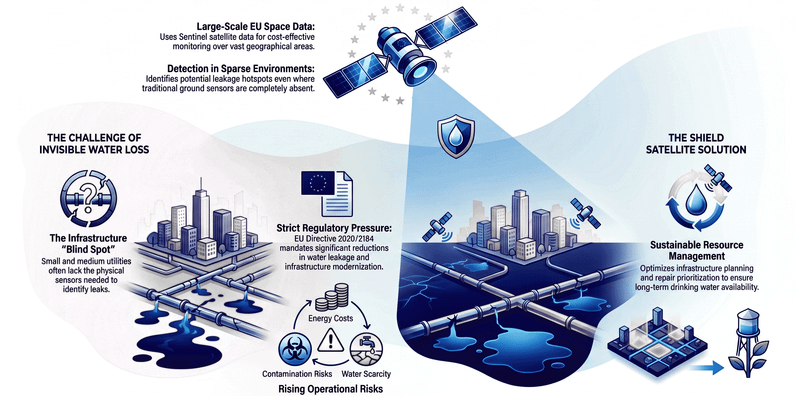

# SHIELD — Satellite-based Hydraulic Infrastructure Evaluation for Leak Detection



**SHIELD** is a proof-of-concept developed for the **CASSINI Hackathon 2026: Space for Water**.

The project explores how freely available **Copernicus Sentinel satellite data** can support early detection of potential water losses and infrastructure-related anomalies in water distribution systems. The current prototype combines optical Sentinel-2 indicators with first Sentinel-1 SAR exports to analyse whether local changes in surface moisture, vegetation condition or surface-water presence can be detected around selected infrastructure points.

The core idea is simple: if an underground leak or infrastructure failure changes local soil moisture or creates surface-water anomalies, this signal may be visible in time series of satellite-derived indicators. SHIELD uses Sentinel imagery to monitor selected infrastructure points and their surroundings, producing interpretable metrics and visualisations that can help utilities prioritise field inspections.

---

## Problem

Water utilities are under increasing pressure to reduce water losses, improve operational efficiency and modernise infrastructure. This is especially challenging for small and medium-sized utilities, where dense networks of flow meters, pressure sensors or continuous monitoring systems may be limited or absent.

Leaks are often difficult to detect early because they can remain invisible at the surface. At the same time, undetected water losses may increase operational costs, energy consumption, contamination risk and the probability of infrastructure failure.

SHIELD is intended as an additional screening layer: it does not replace ground sensors or field inspections, but it can help indicate where field verification may be most valuable.

---

## Our approach

SHIELD investigates whether satellite data can provide an additional, scalable monitoring layer for water infrastructure.

The current repository focuses on the technical proof-of-concept:

- automatic download of Sentinel-2 data for selected areas and time windows,
- export of Sentinel-1 SAR backscatter imagery for the same type of monitored areas,
- extraction of multiple spectral bands and satellite-derived indices,
- computation of local statistics around selected infrastructure points,
- comparison of values across consecutive satellite images,
- basic visualisation of temporal changes in selected indicators.

The prototype currently works with cut-out Sentinel GeoTIFF scenes and point geometries representing monitored locations.

---

## Current prototype features

### 1. Sentinel-2 data download

The script `automatic_download_sentinel_data_for_selected_area.py` uses the Copernicus Data Space / Sentinel Hub Process API to download Sentinel-2 L2A data for a selected bounding box and date range.

The current processing request includes:

- Sentinel-2 reflectance bands:
  - B01, B02, B03, B04, B05, B06, B07, B08, B8A, B09, B11, B12,
- selected spectral indices:
  - NDMI using B8A and B11,
  - NDMI using B08 and B11,
  - NDWI,
  - NDVI,
  - Red-Edge Chlorophyll Index,
  - MCARI.

The downloaded outputs are saved as multi-band GeoTIFF files.

### 2. Sentinel-1 VV backscatter export

The script `shield_sentinel_1_vv_export.py` adds the first Sentinel-1 SAR processing component to the repository.

It exports Sentinel-1 GRD data through the Sentinel Hub Process API for a configured area and time range. The script:

- reads parameters from `config.json`,
- builds a bounding box from configured coordinates,
- uses the selected CRS and output resolution,
- supports configurable polarization, with **VV** as the default,
- requests Sentinel-1 GRD imagery,
- orthorectifies the data,
- converts radar backscatter values to decibels using `10 * log10(value)`,
- uses orbit-based mosaicking,
- saves one GeoTIFF file per configured time interval.

This is the first step toward the target SHIELD logic: combining Sentinel-2 optical indicators with Sentinel-1 SAR backscatter to distinguish vegetation/surface changes from potential local wetness anomalies.

### 3. Spectral index analysis

The notebook `spectral_indices.ipynb` processes multi-band Sentinel-2 GeoTIFF files and calculates selected statistics around points provided as an ESRI Shapefile.

For each image, the workflow can calculate values such as:

- NDVI mean and median,
- NDMI mean and median,
- MNDWI mean and median,
- mean and median values of individual Sentinel-2 bands,
- number of selected pixels,
- number of valid pixels,
- valid pixel fraction.

The output is saved as a CSV file, where each row represents one Sentinel-2 image and its aggregated values for the selected point area.

### 4. Time-series visualisation

The resulting CSV can be used to plot changes in selected indices over time, for example:

- NDVI,
- NDMI,
- MNDWI,
- mean vs. median values,
- sudden changes between consecutive acquisitions.

These visualisations are intended to support early interpretation of whether a location behaves normally or shows a potential anomaly.

---

## Why Sentinel-1 and Sentinel-2?

The current proof-of-concept uses **Sentinel-2** mainly as a surface and vegetation context layer, while **Sentinel-1** provides cloud-independent SAR backscatter information.

| Data source | Role in SHIELD |
|---|---|
| **Sentinel-2 L2A** | optical reflectance, vegetation condition, surface-water and moisture-related indices |
| **Sentinel-1 GRD** | radar backscatter signal, useful under cloud cover and potentially sensitive to surface wetness changes |
| **Point-based GIS data** | monitored infrastructure locations |
| **Future weather data** | rainfall correction and separation of regional wetness from local anomalies |

Key Sentinel-2 indicators:

| Indicator | Purpose |
|---|---|
| **NDVI** | vegetation condition and vegetation-cover context |
| **NDMI** | vegetation and surface moisture-related signal |
| **MNDWI** | possible surface water or local wetness anomalies |
| **B11 / B12** | SWIR information useful for moisture and surface-state interpretation |
| **Red-edge bands** | vegetation stress and condition monitoring |

Planned Sentinel-1 indicators and derived metrics:

| Metric | Purpose |
|---|---|
| **VV backscatter in dB** | first SAR signal used for local change detection |
| **VH backscatter in dB** | future extension for vegetation/volume-scattering context |
| **VV/VH or VH/VV ratio** | future extension for separating vegetation/surface effects |
| **local anomaly score** | future comparison between monitored points and surrounding background |

---

## Target users

SHIELD is designed primarily for:

- small and medium-sized water utilities,
- municipal infrastructure operators,
- local governments responsible for water infrastructure,
- maintenance teams planning field inspections,
- insurers and farmers affected by infrastructure-related water damage.

The solution is especially relevant where ground monitoring infrastructure is sparse and where satellite observations can provide a low-cost additional screening layer.

---

## Repository structure

```text
.
├── automatic_download_sentinel_data_for_selected_area.py
├── shield_sentinel_1_vv_export.py
├── spectral_indices.ipynb
├── idea.png
└── README.md
```

---

## Setup

Create a Python environment and install the main geospatial dependencies:

```bash
pip install requests numpy pandas rasterio geopandas matplotlib python-dateutil requests-oauthlib oauthlib
```

Depending on your system, installing GDAL-related packages may require using Conda:

```bash
conda install -c conda-forge gdal rasterio geopandas
```

---

## Authentication

### Sentinel-2 download script

The Sentinel-2 download script expects Copernicus Data Space / Sentinel Hub credentials.

You can provide them as environment variables:

```bash
CLIENT_ID=your_client_id
CLIENT_SECRET=your_client_secret
```

or through a local `.env` file:

```text
CLIENT_ID=your_client_id
CLIENT_SECRET=your_client_secret
```

or through `config.ini`:

```ini
[auth]
client_id = your_client_id
client_secret = your_client_secret
```

### Sentinel-1 export script

The Sentinel-1 script currently reads credentials and processing parameters from `config.json`.

Example configuration:

```json
{
  "sh_client_id": "your_sentinel_hub_client_id",
  "sh_client_secret": "your_sentinel_hub_client_secret",
  "coordinates": [
    [17.0000, 51.0000],
    [17.0100, 51.0000],
    [17.0100, 51.0100],
    [17.0000, 51.0100]
  ],
  "crs": 4326,
  "output_dir": "sentinel1_exports",
  "base_name": "shield_s1",
  "start_date": "2018-07-01",
  "end_date": "2018-09-30",
  "interval_unit": "days",
  "interval_value": 6,
  "resolution": 10,
  "polarization": "VV"
}
```

Do not commit real credentials to the repository.

---

## Example workflow

1. Define the area of interest as a bounding box or coordinate polygon.
2. Set the date range and time step.
3. Run the Sentinel-2 download script to export optical multi-band GeoTIFFs.
4. Run the Sentinel-1 export script to export VV backscatter GeoTIFFs.
5. Prepare an ESRI Shapefile with points of interest.
6. Run the spectral-index notebook for Sentinel-2 metrics.
7. Compare index values across consecutive images.
8. Plot NDVI, NDMI and MNDWI changes over time.
9. Use Sentinel-1 VV time series as the next step toward local wetness anomaly detection.

---

## Example output

The current Sentinel-2 workflow produces a CSV table similar to:

| image_file | date_from | date_to | NDVI_mean | NDMI_mean | MNDWI_mean | valid_fraction |
|---|---:|---:|---:|---:|---:|---:|
| sentinel2_20180704_20180707.tif | 2018-07-04 | 2018-07-07 | ... | ... | ... | ... |
| sentinel2_20180713_20180716.tif | 2018-07-13 | 2018-07-16 | ... | ... | ... | ... |

The Sentinel-1 export script produces GeoTIFF files with names following the configured base name, date, polarization and CRS, for example:

```text
shield_s1_2018-07-01_VV_EPSG4326.tif
```

---

## Planned development

### Phase 1 — Hackathon / Proof of Concept

- Build simple scripts for selected Sentinel-based indicators.
- Process selected infrastructure locations.
- Generate first time-series plots.
- Demonstrate whether local moisture-related changes are visible in satellite data.

### Phase 2 — Validation pilot

- Test the approach on real operational or historical failure cases.
- Add rainfall correction and local background comparison.
- Extend the method with Sentinel-1 SAR data.
- Validate whether detected anomalies correspond to relevant field events.

### Phase 3 — Minimum Viable Product

- Build a web dashboard.
- Add alert scoring and anomaly visualisation.
- Track false positives and false negatives.
- Collect feedback from at least one external stakeholder.

### Phase 4 — Commercial beta

- Support several paid pilot customers.
- Add automatic reporting.
- Improve operational robustness.
- Prepare integration with GIS and infrastructure-management tools.

### Phase 5 — Version 1.0 and scaling

- Release a scalable product version.
- Improve detection models using customer feedback.
- Support larger monitored areas and multiple clients.
- Add recurring reporting and operational deployment workflows.

---

## Limitations of the current prototype

This repository is an early hackathon proof-of-concept. It is not yet a production leak-detection system.

Current limitations include:

- Sentinel-2 observations are affected by clouds and cloud shadows.
- The current Sentinel-1 script exports VV backscatter imagery but does not yet calculate final anomaly scores.
- Satellite signals may be affected by vegetation growth, surface changes, land use, soil roughness and weather.
- The current metrics should be treated as anomaly indicators, not direct measurements of underground leakage.
- Operational validation against real failure records is required.
- Rainfall correction and point-vs-background anomaly detection are planned but not yet fully implemented.

---

## Next steps

The most important next technical steps are:

- align Sentinel-1 and Sentinel-2 time series for the same monitored areas,
- add Sentinel-1 SAR-based local wetness anomaly detection,
- add rainfall correction using weather or reanalysis data,
- compare each monitored point against its local background area,
- add cloud and scene-quality filtering,
- validate detections against known leak or infrastructure-failure events,
- create an interactive dashboard for anomaly review.

---

## Team

SHIELD is developed by an interdisciplinary team combining expertise in:

- environmental engineering,
- hydrology,
- GIS,
- satellite data analysis,
- machine learning,
- software development,
- water utility operations,
- visual communication and design.

---

## Project links

- CASSINI project page: https://taikai.network/cassinihackathons/hackathons/space-for-water/projects/cmnzx2zt202bs1axa8vl2nywy/idea
- Repository: https://github.com/TeoNiz/Cassini_hackathon_2026_SHIELD

---
